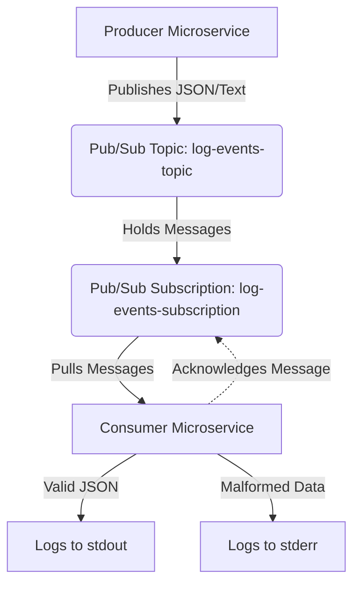
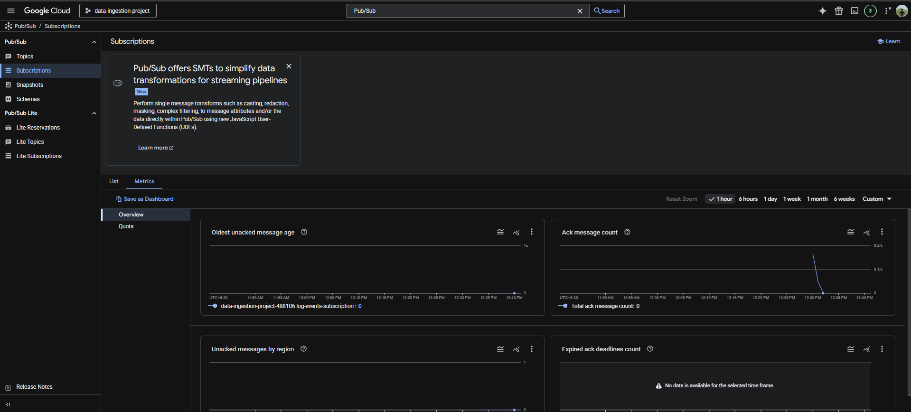

# Real-Time Event Ingestion System

A resilient, scalable, event-driven data ingestion pipeline built with Python microservices, Docker, and Google Cloud Pub/Sub.

## Project Overview

This project implements a robust real-time event ingestion layer designed to handle simulated log data. It utilizes an event-driven architecture to decouple data generation from downstream processing. A producer service simulates the generation of valid and malformed log entries, publishing them to a Google Cloud Pub/Sub topic. A standalone consumer microservice continuously pulls from a subscription, validates the JSON payloads, processes valid data, and gracefully logs and discards toxic payloads without interrupting the service. 

Both services are fully containerized and orchestrated via Docker Compose, demonstrating cloud-native development practices and local reproducibility.

## Architecture Diagram



## Repository Structure

```text
├── consumer/
│   ├── tests/
│   │   └── test_processor.py
│   ├── app.py
│   ├── Dockerfile
│   └── requirements.txt
├── producer/
│   ├── app.py
│   ├── Dockerfile
│   └── requirements.txt
├── secrets/
│   └── service-account.json (Ignored by Git)
├── .env.example
├── docker-compose.yml
└── README.md

```

## Prerequisites

* **Docker & Docker Compose**: Installed and running locally.
* **Google Cloud Platform (GCP) Account**: An active project with the Pub/Sub API enabled.
* **Python 3.9+**: For executing local unit tests.

## Environment Setup

### 1. GCP Infrastructure

1. Enable the **Cloud Pub/Sub API** within your GCP project.
2. Navigate to **IAM & Admin > Service Accounts** and create a dedicated service account.
3. Grant the service account the **Pub/Sub Publisher** and **Pub/Sub Subscriber** roles.
4. Generate a JSON key for this service account and download it.
5. In Pub/Sub, create a new Topic named `log-events-topic`.
6. Create a Pull Subscription attached to that topic named `log-events-subscription`.

### 2. Local Configuration

1. Create a `secrets/` directory in the root of this repository.
2. Move your downloaded GCP JSON key into `secrets/` and ensure it is named exactly `service-account.json`. *(Note: This directory must be excluded from version control).*
3. Duplicate the `.env.example` file, rename it to `.env`, and populate it with your specific project details:

```env
GCP_PROJECT_ID=your-actual-gcp-project-id
GCP_PUBSUB_TOPIC=log-events-topic
GCP_PUBSUB_SUBSCRIPTION=log-events-subscription
CREDENTIALS_PATH=./secrets/service-account.json

```

## Execution Instructions

To build the Docker images and orchestrate the environment, run the following command from the project root:

```bash
docker-compose up --build

```

**Expected Behavior:**

* The `consumer` service will initialize and block, listening for incoming messages.
* The `producer` service will start, systematically publish 10 valid JSON messages followed by 3 intentionally malformed text strings, and then exit with a status code of 0.
* The `consumer` will process all 13 messages, logging the valid payloads to standard output (`stdout`) and capturing the parsing exceptions for the malformed payloads to standard error (`stderr`).

## Running the Test Suite

The consumer service includes a suite of unit tests verifying the message parsing and validation logic. To execute the tests locally:

```bash
cd consumer
pip install -r requirements.txt
pytest tests/test_processor.py

```

## Architecture & Design Decisions

* **Decoupled Messaging**: Utilizing GCP Pub/Sub allows the ingestion layer to scale horizontally and absorb traffic spikes without overwhelming the downstream consumer microservice.
* **Graceful Error Handling**: A critical design requirement is the prevention of infinite reprocessing loops. When the consumer encounters a `JSONDecodeError` from a malformed payload, it explicitly catches the exception, logs the raw data for auditing to standard error, and issues an acknowledgment (`ack`) back to Pub/Sub. This permanently removes the toxic payload from the queue while keeping the microservice alive.
* **Optimized Containerization**: The consumer utilizes a multi-stage Docker build pipeline. By isolating the dependency compilation in a builder stage and copying only the final artifacts to the runner stage, the final production image remains lightweight, secure, and highly optimized for deployment.

## Demonstration of Functionality

**Producer Output (Publishing):**

```text
Published message ID: 17971670009709088
Published message ID: 17971662150648475
...
producer-1 exited with code 0

```

**Consumer Output (Error Handling):**

```text
ERROR: Malformed JSON received: invalid non-JSON string
ERROR: Malformed JSON received: {"timestamp": "2023-10-27", "service_name": "auth-service"
ERROR: Malformed JSON received: just another bad payload

```

## GCP Metrics Screenshot



